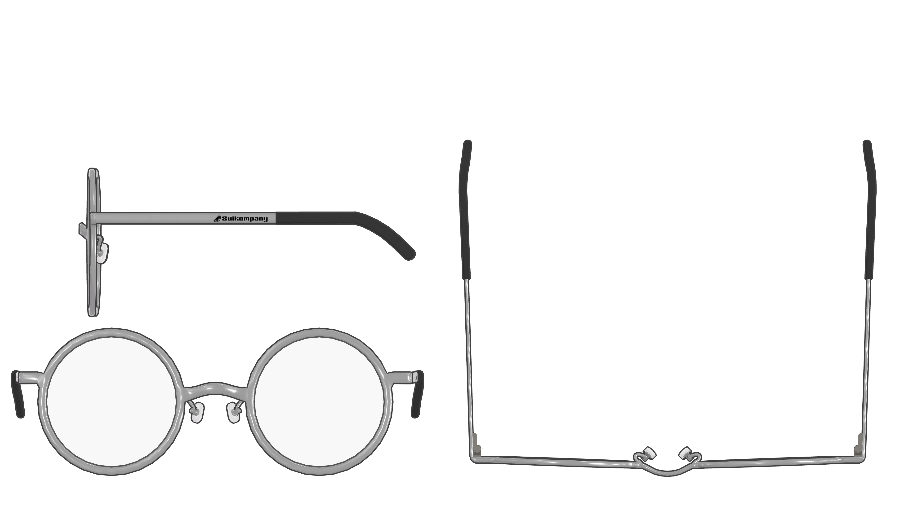
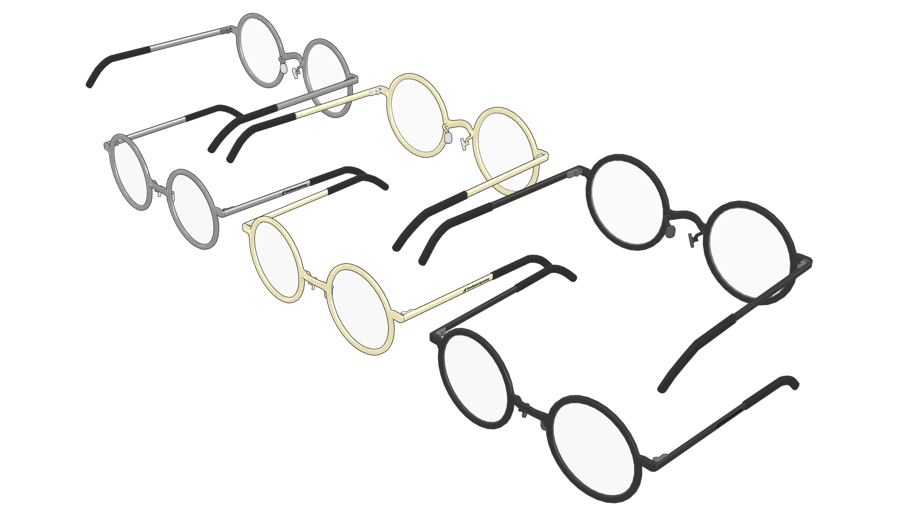
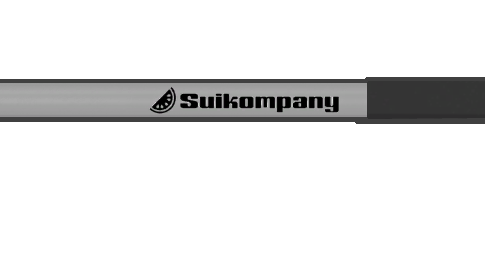

import { YouTube } from '@astro-community/astro-embed-youtube';

## 基本機能
- PhysBone による掴み（Grab）と固定（Pose）
  - メガネの中央前方を掴む（Grabする）とメガネを上下に動かせます。
  - PhysBone を使用しているため、他人が動かすことも可能です。
- メガネを外す/掛けなおす/ワールド固定する
  - メガネのレンズの右側で右手を握る（Fistにする）とメガネを持ちます。
    - レンズの左側で左手を握ることでも持ちます。
  - メガネを持っている手を開く（Openにする）と、メガネを掛けたりワールド固定したりできます。
    - メガネを掛けたい場合: 初めにメガネが掛けられていた位置で手を開きます
    - ワールド固定したい場合: ↑の位置以外で手を開きます
- 非着用時、メガネが視界に映る
  - HeadChop によってメガネが表示されます。

これらの基本機能は [デモ動画](https://youtu.be/UwoYmtyJvME) にて紹介しています。
<YouTube id="UwoYmtyJvME" />

## エクスプレッションメニュー（Expressions Menu）

`GrabbableEyewearMenu` に本ギミックの操作用メニューが配置されます。

- `OFF`
  - 有効: 本ギミック（PhysBone含む）が無効化され、メガネが非表示になります。
  - 無効: 本ギミックが有効化（初期化）され、メガネが掛けなおされます。メガネの場所が分からなくなった時にも有用です。
- `PB OFF`
  - 有効: PhysBone が無効化され、メガネの中央付近を掴んで動かせなくなります。
      Grab/Poseされていた場合、元の位置に戻ります。
  - 無効: PhysBone が有効化されます。
- `Moving OFF`
  - 有効: メガネの左右のレンズ付近を掴んで持ったりワールドに置いたりといった、手とジェスチャーによるメガネの配置変更が行われなくなります。

## 付属メガネの仕様

- ポリゴン数: 3528
- マテリアル（[lilToon](https://lilxyzw.github.io/lilToon/)）: 4
  - フレーム3種（シルバー、ゴールド、ブラック）
  - レンズ
- テクスチャ: 5
  - フレーム3種（シルバー、ゴールド、ブラック）
  - Matcap
  - NormalMap
- シェイプキー: 4
  - NosePad_OFF: 鼻当て（ノーズパッド）を隠す
  - Temple_Long: つるを長くする
  - Temple_Short: つるを短くする
  - Temple_Open: つるを開く

### イメージ

- 三面図

- カラーバリエーション

- ロゴのズーム

