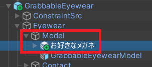
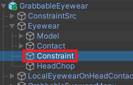
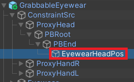
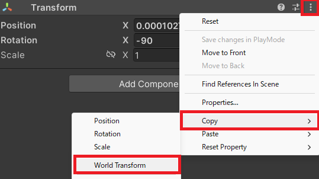
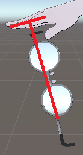

import { Steps } from '@astrojs/starlight/components';
import { LinkCard } from '@astrojs/starlight/components';

## 要件

- メガネの3Dモデルを持っている
  - ギミックが入っている場合は競合する可能性があります
- [Modular Avatar](https://modular-avatar.nadena.dev) が導入されている
- `Expression Parameters` に `3` 以上の空きがある
  - パフォーマンスランクへの影響は [パフォーマンスランクへの影響](../references/performance-rank/) をご確認ください

## アバターに導入する

<Steps>
1. `HiroMelon/GrabbableEyewear/` フォルダにある`GrabbableEyewear` プレハブをアバター直下に配置してください。
2. `GrabbableEyewear/Eyewear/Model` 直下に使いたいメガネを配置してください。
    
    - メガネに MA Bone Proxy コンポーネントが含まれている場合、必ず削除してください。
3. 配置したメガネの Transform コンポーネントの Position を `0` `0` `0` にしてください。
    
    - メガネの位置調整は後述の手順で行います。
</Steps>

## メガネの位置調整

### メガネをかける位置を調整する

<Steps>
1. `GrabbableEyewear/Eyewear/Constraint` を選択します。
    
2. `VRC Parent Constraint` コンポーネントの Sources の Weight が上から `1` `0` `0` であり、メガネが頭付近にあることを確認します。
    
3. 一つ目（Element 0）の Source Transform 右にある `EyewearHeadPos` をダブルクリックし、`GrabbableEyewear/ConstraintSrc/Head/PBRoot/PBEnd/EyewearHeadPos` が選択されていることを確認します。
    
    :::tip
    Constraint の Transform をダブルクリックすると該当GameObjectが選択されるため、ヒエラルキーから探す手間が省けます。
    :::
4. `EyewearHeadPos` を移動及び回転させて位置調整してください。
    :::tip
    既にかけているメガネに本ギミックを導入する場合、そのメガネの World Transform をコピー&ペーストすることで簡単に位置調整ができます。
    
    
    1. 元のメガネの位置の World Transform をコピー
    2. `EyewearHeadPos` に World Transform をペースト
    :::
</Steps>

### 右手に持つ位置を調整する

<Steps>
1. `GrabbableEyewear/Eyewear/Constraint` を選択します。
2. `VRC Parent Constraint` コンポーネントの Sources の3つのWeightを上から `0` `1` `0` に変更し、メガネを右手に持つ位置へ移動させます。
    
3. 二つ目（Element 1）の Source Transform 右にある `EyewearHandRPos` をダブルクリックし、`GrabbableEyewear/ConstraintSrc/HandR/EyewearHandRPos` が選択されていることを確認します。
4. `EyewearHandRPos` を移動及び回転させて位置調整してください。
    :::note
    まずは伸ばした人差し指の第二関節（中央）から垂直にメガネを配置し、ゲーム内で実際に持ってみて細かく調節していきましょう。
    
    :::
</Steps>

### 左手に持つ位置を調整する

<Steps>
1. `GrabbableEyewear/Eyewear/Constraint` を選択します。
2. `VRC Parent Constraint` コンポーネントの Sources の3つのWeightを上から `0` `0` `1` に変更し、メガネを左手に持つ位置へ移動させます。
    
3. 三つ目（Element 2）の Source Transform 右にある `EyewearHandLPos` をダブルクリックし、`GrabbableEyewear/ConstraintSrc/HandL/EyewearHandLPos` が選択されていることを確認します。
4. `EyewearHandLPos` を移動及び回転させて位置調整してください。
    :::note
    先ほど設定した `EyewearHandRPos` から Position 及び Rotation をコピーし、Position X の正負を反転、Rotation Y を 180 度追加すると左右対称になるはずです。
    :::
</Steps>

### Constraint を元に戻す

位置調整完了後、 `VRC Parent Constraint` コンポーネント の Sources の Weight を上から `1` `0` `0` に戻してください。  

戻さなくてもギミックに問題は発生しませんが、今後の調整が困難になります。

:::tip
Prefab の Revert 機能を利用すると、お手軽に元の状態に戻せます。

1. 元の状態に戻したいコンポーネントの右側にある三点リーダをクリック
2. `Modified Component` をクリックorマウスオーバー
3. `Revert` をクリック
:::

### その他の調整について

一般的なメガネのモデルであればこれ以上の調整は不要ですが、特殊な形状のモデルやメガネ以外のモデルに使用する場合、判定の調整が必要になる場合があります。  
判定などその他の調整方法については [その他の調整](../references/adjustment/) をご覧ください。
